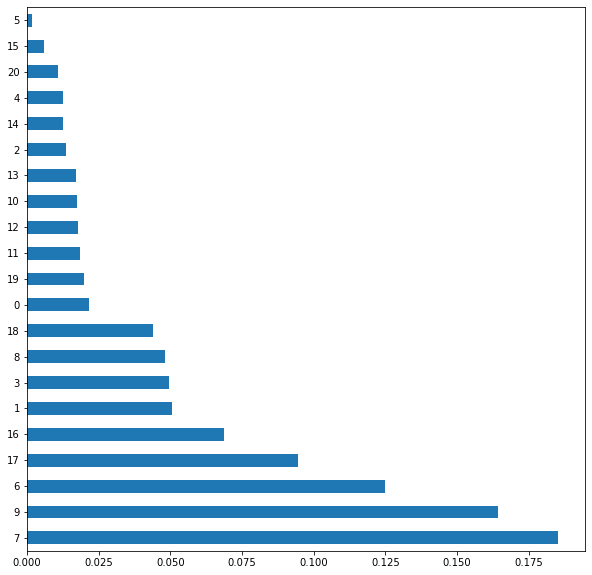

# Fetal Health Classification

This tool was developed with the goal of helping predict fetal health in order to prevent child and maternal mortality.

## Context
Reduction of child mortality is reflected in several of the United Nations' Sustainable Development Goals and is a key indicator of human progress.
The UN expects that by 2030, countries end preventable deaths of newborns and children under 5 years of age, with all countries aiming to reduce under‑5 mortality to at least as low as 25 per 1,000 live births.

Parallel to notion of child mortality is of course maternal mortality, which accounts for 295 000 deaths during and following pregnancy and childbirth (as of 2017). The vast majority of these deaths (94%) occurred in low-resource settings, and most could have been prevented.

In light of what was mentioned above, Cardiotocograms (CTGs) are a simple and cost accessible option to assess fetal health, allowing healthcare professionals to take action in order to prevent child and maternal mortality. The equipment itself works by sending ultrasound pulses and reading its response, thus shedding light on fetal heart rate (FHR), fetal movements, uterine contractions and more.

## Project content
* Data Exploration and Visualization
* Data cleaning
* Data Transforming
* Modeling and Hyperparameter tunning
* Unsupervised training
* Evaluation

## Target Variable

Let's talk about our target variable, fetal health.
For this project, fetal health was separated into 3 different categories.
* Normal
* Suspect
* Pathological

We will use other variables to try to predict in which category we would include the health of a baby never before seen by the algorithm. Given the importance of the prediction, we will set our goal to develop a tool that has at least a 90% accuracy.

#### Libraries and packages


```python
import warnings
warnings.simplefilter(action ="ignore")
warnings.filterwarnings('ignore')

# Import the necessary packages
import numpy as np
import pandas as pd

# Data visualization
import matplotlib.pyplot as plt
import seaborn as sns

# Algorithms
from sklearn.model_selection import train_test_split
from sklearn.linear_model import LogisticRegression
from sklearn.neighbors import KNeighborsClassifier
from sklearn.ensemble import RandomForestClassifier
from sklearn.ensemble import GradientBoostingClassifier
from lightgbm import LGBMClassifier

from sklearn.model_selection import RandomizedSearchCV
from sklearn.model_selection import GridSearchCV
from sklearn.metrics import classification_report
```

Let´s load the dataset


```python
data = pd.read_csv('data/fetal_health.csv')

X = data.drop('fetal_health', axis=1)
y = data['fetal_health']

X_train, X_test, y_train, y_test = train_test_split(
    X, y, test_size=0.3, random_state=123)

train = X_train.join(y_train)
```

## Data Exploration, Visualization and Analysis
### Exploration


```python
train.head(5)
```


<div>
<style scoped>
    .dataframe tbody tr th:only-of-type {
        vertical-align: middle;
    }

    .dataframe tbody tr th {
        vertical-align: top;
    }

    .dataframe thead th {
        text-align: right;
    }
</style>
<table border="1" class="dataframe">
  <thead>
    <tr style="text-align: right;">
      <th></th>
      <th>baseline value</th>
      <th>accelerations</th>
      <th>fetal_movement</th>
      <th>uterine_contractions</th>
      <th>light_decelerations</th>
      <th>severe_decelerations</th>
      <th>prolongued_decelerations</th>
      <th>abnormal_short_term_variability</th>
      <th>mean_value_of_short_term_variability</th>
      <th>percentage_of_time_with_abnormal_long_term_variability</th>
      <th>...</th>
      <th>histogram_min</th>
      <th>histogram_max</th>
      <th>histogram_number_of_peaks</th>
      <th>histogram_number_of_zeroes</th>
      <th>histogram_mode</th>
      <th>histogram_mean</th>
      <th>histogram_median</th>
      <th>histogram_variance</th>
      <th>histogram_tendency</th>
      <th>fetal_health</th>
    </tr>
  </thead>
  <tbody>
    <tr>
      <th>678</th>
      <td>140.0</td>
      <td>0.010</td>
      <td>0.000</td>
      <td>0.000</td>
      <td>0.000</td>
      <td>0.0</td>
      <td>0.0</td>
      <td>58.0</td>
      <td>1.2</td>
      <td>0.0</td>
      <td>...</td>
      <td>62.0</td>
      <td>188.0</td>
      <td>4.0</td>
      <td>0.0</td>
      <td>176.0</td>
      <td>164.0</td>
      <td>169.0</td>
      <td>27.0</td>
      <td>1.0</td>
      <td>1.0</td>
    </tr>
    <tr>
      <th>512</th>
      <td>154.0</td>
      <td>0.003</td>
      <td>0.003</td>
      <td>0.003</td>
      <td>0.000</td>
      <td>0.0</td>
      <td>0.0</td>
      <td>56.0</td>
      <td>0.6</td>
      <td>1.0</td>
      <td>...</td>
      <td>140.0</td>
      <td>171.0</td>
      <td>1.0</td>
      <td>0.0</td>
      <td>161.0</td>
      <td>160.0</td>
      <td>162.0</td>
      <td>2.0</td>
      <td>1.0</td>
      <td>1.0</td>
    </tr>
    <tr>
      <th>613</th>
      <td>146.0</td>
      <td>0.009</td>
      <td>0.003</td>
      <td>0.001</td>
      <td>0.000</td>
      <td>0.0</td>
      <td>0.0</td>
      <td>41.0</td>
      <td>1.9</td>
      <td>0.0</td>
      <td>...</td>
      <td>50.0</td>
      <td>180.0</td>
      <td>7.0</td>
      <td>0.0</td>
      <td>154.0</td>
      <td>152.0</td>
      <td>155.0</td>
      <td>18.0</td>
      <td>1.0</td>
      <td>1.0</td>
    </tr>
    <tr>
      <th>831</th>
      <td>152.0</td>
      <td>0.000</td>
      <td>0.000</td>
      <td>0.002</td>
      <td>0.002</td>
      <td>0.0</td>
      <td>0.0</td>
      <td>61.0</td>
      <td>0.5</td>
      <td>61.0</td>
      <td>...</td>
      <td>99.0</td>
      <td>160.0</td>
      <td>4.0</td>
      <td>3.0</td>
      <td>159.0</td>
      <td>155.0</td>
      <td>158.0</td>
      <td>4.0</td>
      <td>1.0</td>
      <td>2.0</td>
    </tr>
    <tr>
      <th>369</th>
      <td>138.0</td>
      <td>0.000</td>
      <td>0.008</td>
      <td>0.001</td>
      <td>0.002</td>
      <td>0.0</td>
      <td>0.0</td>
      <td>64.0</td>
      <td>0.4</td>
      <td>30.0</td>
      <td>...</td>
      <td>118.0</td>
      <td>159.0</td>
      <td>2.0</td>
      <td>0.0</td>
      <td>144.0</td>
      <td>143.0</td>
      <td>145.0</td>
      <td>5.0</td>
      <td>0.0</td>
      <td>2.0</td>
    </tr>
  </tbody>
</table>
<p>5 rows × 22 columns</p>
</div>


```python
train.info()
```

    <class 'pandas.core.frame.DataFrame'>
    Int64Index: 1488 entries, 678 to 1346
    Data columns (total 22 columns):
     #   Column                                                  Non-Null Count  Dtype  
    ---  ------                                                  --------------  -----  
     0   baseline value                                          1488 non-null   float64
     1   accelerations                                           1488 non-null   float64
     2   fetal_movement                                          1488 non-null   float64
     3   uterine_contractions                                    1488 non-null   float64
     4   light_decelerations                                     1488 non-null   float64
     5   severe_decelerations                                    1488 non-null   float64
     6   prolongued_decelerations                                1488 non-null   float64
     7   abnormal_short_term_variability                         1488 non-null   float64
     8   mean_value_of_short_term_variability                    1488 non-null   float64
     9   percentage_of_time_with_abnormal_long_term_variability  1488 non-null   float64
     10  mean_value_of_long_term_variability                     1488 non-null   float64
     11  histogram_width                                         1488 non-null   float64
     12  histogram_min                                           1488 non-null   float64
     13  histogram_max                                           1488 non-null   float64
     14  histogram_number_of_peaks                               1488 non-null   float64
     15  histogram_number_of_zeroes                              1488 non-null   float64
     16  histogram_mode                                          1488 non-null   float64
     17  histogram_mean                                          1488 non-null   float64
     18  histogram_median                                        1488 non-null   float64
     19  histogram_variance                                      1488 non-null   float64
     20  histogram_tendency                                      1488 non-null   float64
     21  fetal_health                                            1488 non-null   float64
    dtypes: float64(22)
    memory usage: 307.4 KB
    


```python
train.describe().T
```


<div>
<style scoped>
    .dataframe tbody tr th:only-of-type {
        vertical-align: middle;
    }

    .dataframe tbody tr th {
        vertical-align: top;
    }

    .dataframe thead th {
        text-align: right;
    }
</style>
<table border="1" class="dataframe">
  <thead>
    <tr style="text-align: right;">
      <th></th>
      <th>count</th>
      <th>mean</th>
      <th>std</th>
      <th>min</th>
      <th>25%</th>
      <th>50%</th>
      <th>75%</th>
      <th>max</th>
    </tr>
  </thead>
  <tbody>
    <tr>
      <th>baseline value</th>
      <td>1488.0</td>
      <td>133.290995</td>
      <td>9.883484</td>
      <td>106.0</td>
      <td>126.000</td>
      <td>133.000</td>
      <td>141.000</td>
      <td>160.000</td>
    </tr>
    <tr>
      <th>accelerations</th>
      <td>1488.0</td>
      <td>0.003185</td>
      <td>0.003862</td>
      <td>0.0</td>
      <td>0.000</td>
      <td>0.002</td>
      <td>0.006</td>
      <td>0.018</td>
    </tr>
    <tr>
      <th>fetal_movement</th>
      <td>1488.0</td>
      <td>0.008259</td>
      <td>0.042758</td>
      <td>0.0</td>
      <td>0.000</td>
      <td>0.000</td>
      <td>0.003</td>
      <td>0.481</td>
    </tr>
    <tr>
      <th>uterine_contractions</th>
      <td>1488.0</td>
      <td>0.004313</td>
      <td>0.002934</td>
      <td>0.0</td>
      <td>0.002</td>
      <td>0.004</td>
      <td>0.006</td>
      <td>0.014</td>
    </tr>
    <tr>
      <th>light_decelerations</th>
      <td>1488.0</td>
      <td>0.001862</td>
      <td>0.002961</td>
      <td>0.0</td>
      <td>0.000</td>
      <td>0.000</td>
      <td>0.003</td>
      <td>0.015</td>
    </tr>
    <tr>
      <th>severe_decelerations</th>
      <td>1488.0</td>
      <td>0.000003</td>
      <td>0.000052</td>
      <td>0.0</td>
      <td>0.000</td>
      <td>0.000</td>
      <td>0.000</td>
      <td>0.001</td>
    </tr>
    <tr>
      <th>prolongued_decelerations</th>
      <td>1488.0</td>
      <td>0.000141</td>
      <td>0.000535</td>
      <td>0.0</td>
      <td>0.000</td>
      <td>0.000</td>
      <td>0.000</td>
      <td>0.005</td>
    </tr>
    <tr>
      <th>abnormal_short_term_variability</th>
      <td>1488.0</td>
      <td>47.096102</td>
      <td>17.085395</td>
      <td>12.0</td>
      <td>32.000</td>
      <td>49.000</td>
      <td>61.000</td>
      <td>87.000</td>
    </tr>
    <tr>
      <th>mean_value_of_short_term_variability</th>
      <td>1488.0</td>
      <td>1.328831</td>
      <td>0.886662</td>
      <td>0.2</td>
      <td>0.700</td>
      <td>1.200</td>
      <td>1.700</td>
      <td>7.000</td>
    </tr>
    <tr>
      <th>percentage_of_time_with_abnormal_long_term_variability</th>
      <td>1488.0</td>
      <td>9.983871</td>
      <td>18.577807</td>
      <td>0.0</td>
      <td>0.000</td>
      <td>0.000</td>
      <td>11.000</td>
      <td>91.000</td>
    </tr>
    <tr>
      <th>mean_value_of_long_term_variability</th>
      <td>1488.0</td>
      <td>8.246438</td>
      <td>5.693201</td>
      <td>0.0</td>
      <td>4.600</td>
      <td>7.500</td>
      <td>10.900</td>
      <td>50.700</td>
    </tr>
    <tr>
      <th>histogram_width</th>
      <td>1488.0</td>
      <td>69.969758</td>
      <td>39.372667</td>
      <td>3.0</td>
      <td>36.000</td>
      <td>67.000</td>
      <td>100.250</td>
      <td>176.000</td>
    </tr>
    <tr>
      <th>histogram_min</th>
      <td>1488.0</td>
      <td>93.774194</td>
      <td>29.700954</td>
      <td>50.0</td>
      <td>67.000</td>
      <td>93.000</td>
      <td>120.000</td>
      <td>155.000</td>
    </tr>
    <tr>
      <th>histogram_max</th>
      <td>1488.0</td>
      <td>163.743952</td>
      <td>18.140627</td>
      <td>122.0</td>
      <td>151.000</td>
      <td>162.000</td>
      <td>174.000</td>
      <td>238.000</td>
    </tr>
    <tr>
      <th>histogram_number_of_peaks</th>
      <td>1488.0</td>
      <td>4.040995</td>
      <td>3.005767</td>
      <td>0.0</td>
      <td>2.000</td>
      <td>3.000</td>
      <td>6.000</td>
      <td>18.000</td>
    </tr>
    <tr>
      <th>histogram_number_of_zeroes</th>
      <td>1488.0</td>
      <td>0.327957</td>
      <td>0.753364</td>
      <td>0.0</td>
      <td>0.000</td>
      <td>0.000</td>
      <td>0.000</td>
      <td>10.000</td>
    </tr>
    <tr>
      <th>histogram_mode</th>
      <td>1488.0</td>
      <td>137.543683</td>
      <td>16.182615</td>
      <td>60.0</td>
      <td>129.000</td>
      <td>139.000</td>
      <td>148.000</td>
      <td>187.000</td>
    </tr>
    <tr>
      <th>histogram_mean</th>
      <td>1488.0</td>
      <td>134.691532</td>
      <td>15.432030</td>
      <td>73.0</td>
      <td>125.000</td>
      <td>136.000</td>
      <td>145.000</td>
      <td>180.000</td>
    </tr>
    <tr>
      <th>histogram_median</th>
      <td>1488.0</td>
      <td>138.201613</td>
      <td>14.269137</td>
      <td>79.0</td>
      <td>129.000</td>
      <td>139.000</td>
      <td>148.000</td>
      <td>183.000</td>
    </tr>
    <tr>
      <th>histogram_variance</th>
      <td>1488.0</td>
      <td>18.342742</td>
      <td>28.499592</td>
      <td>0.0</td>
      <td>2.000</td>
      <td>7.000</td>
      <td>23.000</td>
      <td>269.000</td>
    </tr>
    <tr>
      <th>histogram_tendency</th>
      <td>1488.0</td>
      <td>0.324597</td>
      <td>0.603854</td>
      <td>-1.0</td>
      <td>0.000</td>
      <td>0.000</td>
      <td>1.000</td>
      <td>1.000</td>
    </tr>
    <tr>
      <th>fetal_health</th>
      <td>1488.0</td>
      <td>1.301747</td>
      <td>0.609009</td>
      <td>1.0</td>
      <td>1.000</td>
      <td>1.000</td>
      <td>1.000</td>
      <td>3.000</td>
    </tr>
  </tbody>
</table>
</div>


### Visualization


```python
# Definition of a function to visualize correlation between variables
import seaborn as sn
import matplotlib.pyplot as plt


def plot_correlation(df):
    corr_matrix = df.corr()
    heat_map = sn.heatmap(corr_matrix, annot=False)
    plt.show(heat_map)
```

Lets visualize first and comprehend the meaning behind our target variable, fetal_health


```python
train.groupby(['fetal_health']).count().plot(kind='pie', y='accelerations', autopct='%1.1f%%',
                                             startangle=90, labels=['Normal', 'Suspect', 'Pathological'], figsize=(7, 7))
```


    <matplotlib.axes._subplots.AxesSubplot at 0x2a5c37cdb20>


In the chart below we can see the correlation between fetal health and the rest of the variables


```python
plot_correlation(train)
```


In the following comparison, we can see the distribution of data between each variable and fetal health


```python
data_hist_plot = data.hist(figsize = (20,20), color = "#5F9EA0")
```


## Data Cleaning
we will clean the data set of variables that contribute noise to the machine learning algorithm


```python
from sklearn.ensemble import ExtraTreesRegressor
import matplotlib.pyplot as plt
etr_model = ExtraTreesRegressor()
etr_model.fit(X_train, y_train)

feat_importances = pd.Series(etr_model.feature_importances_)
feat_importances.nlargest(30).plot(kind='barh', figsize=(10, 10))
plt.show()
```





```python
selected_features = etr_model.feature_importances_

selected = [index for index in range(
    selected_features.size) if selected_features[index] >= 0.06]
```


```python
X_train = X_train.iloc[:, selected]
X_test = X_test.iloc[:, selected]
```

## Data Transforming
Now it is time to normalize data, in this case we used MinMaxScaler with a range of 0-1


```python
from sklearn.preprocessing import MinMaxScaler
from sklearn.compose import ColumnTransformer
```


```python
dif_values = y_train.unique()
```


```python
# Now we create the transformers
t_norm = ("normalizer", MinMaxScaler(feature_range=(0, 1)), X_train.columns)
```


```python
column_transformer_X = ColumnTransformer(
    transformers=[t_norm], remainder='passthrough')

column_transformer_X.fit(X_train);
```


```python
X_train = column_transformer_X.transform(X_train)
X_test = column_transformer_X.transform(X_test)
```

## Modeling and Hyperparameter tunning
We will run serveral grid search (some of them randomized to optimize time/performance efficiency)


```python
from sklearn.metrics import make_scorer
from sklearn.pipeline import make_pipeline
from sklearn.pipeline import Pipeline


from sklearn.metrics import accuracy_score
from sklearn.metrics import classification_report
from lightgbm import LGBMClassifier


from sklearn import tree
from sklearn.ensemble import GradientBoostingClassifier
```


```python
X_val_train, X_val_test, y_val_train, y_val_test = train_test_split(
    X_train, y_train, test_size=0.20, random_state=123)
```


```python
scorer = make_scorer(accuracy_score, greater_is_better=True)
```

### Decision Tree Classifier


```python
pipe_tree = tree.DecisionTreeClassifier(random_state=123)

criteria = ['gini', 'entropy']
splitter = ['best', 'random']
max_depth = [int(x) for x in np.linspace(10, 110, num=22)]
max_features = ['auto', 'sqrt', 'log2', None]
min_samples_split = [2, 5, 10]
min_samples_leaf = [1, 2, 4]

param_grid_tree = {'max_features': max_features,
                   'max_depth': max_depth,
                   'min_samples_split': min_samples_split,
                   'min_samples_leaf': min_samples_leaf,
                   'criterion': criteria,
                   'splitter': splitter
                   }

gs_tree = GridSearchCV(estimator=pipe_tree, param_grid=param_grid_tree,
                       cv=10, verbose=2, n_jobs=-1)
best_tree = gs_tree.fit(X_val_train, y_val_train)
```

    Fitting 10 folds for each of 3168 candidates, totalling 31680 fits
    

    [Parallel(n_jobs=-1)]: Using backend LokyBackend with 12 concurrent workers.
    [Parallel(n_jobs=-1)]: Done  17 tasks      | elapsed:    1.3s
    [Parallel(n_jobs=-1)]: Done 492 tasks      | elapsed:    1.8s
    [Parallel(n_jobs=-1)]: Done 20620 tasks      | elapsed:    7.3s
    [Parallel(n_jobs=-1)]: Done 31680 out of 31680 | elapsed:    9.8s finished
    


```python
print(classification_report(y_val_test,best_tree.predict(X_val_test)))
```

                  precision    recall  f1-score   support
    
             1.0       0.95      0.96      0.96       240
             2.0       0.78      0.73      0.75        44
             3.0       0.69      0.79      0.73        14
    
        accuracy                           0.92       298
       macro avg       0.81      0.82      0.81       298
    weighted avg       0.92      0.92      0.92       298
    
    


```python
print(best_tree.best_params_)
```

    {'criterion': 'gini', 'max_depth': 10, 'max_features': 'auto', 'min_samples_leaf': 2, 'min_samples_split': 5, 'splitter': 'best'}
    

### Logistic regression


```python
pipe_lr = LogisticRegression()

penalty = ['l1', 'l2', 'elasticnet', 'none']
dual = [True, False]
c = np.linspace(0.0001, 10000, num=10)
tol = np.linspace(1e-4, 1e-2, num=10)
fit_intercept = [True, False]
class_weight = ['balanced', None]
solver = ['newton-cg', 'lbfgs', 'liblinear', 'sag', 'saga']
multi_class = ['auto', 'ovr', 'multinomial']

param_grid_lr = {'penalty': penalty,
                 'dual': dual,
                 'C': c,
                 'tol': tol,
                 'fit_intercept': fit_intercept,
                 'class_weight': class_weight,
                 'solver': solver,
                 'multi_class': multi_class}

gs_lr = GridSearchCV(estimator=pipe_lr, param_grid=param_grid_lr,
                     cv=10, verbose=2, n_jobs=-1)
gs_lr.fit(X_val_train, y_val_train)
```

    [Parallel(n_jobs=-1)]: Using backend LokyBackend with 12 concurrent workers.
    [Parallel(n_jobs=-1)]: Done  17 tasks      | elapsed:    0.0s
    

    Fitting 10 folds for each of 48000 candidates, totalling 480000 fits
    

    [Parallel(n_jobs=-1)]: Done 1320 tasks      | elapsed:    0.6s
    [Parallel(n_jobs=-1)]: Done 14120 tasks      | elapsed:    3.8s
    [Parallel(n_jobs=-1)]: Done 32232 tasks      | elapsed:   12.4s
    [Parallel(n_jobs=-1)]: Done 55592 tasks      | elapsed:   22.0s
    [Parallel(n_jobs=-1)]: Done 73224 tasks      | elapsed:   37.5s
    [Parallel(n_jobs=-1)]: Done 98172 tasks      | elapsed:   52.0s
    [Parallel(n_jobs=-1)]: Done 122700 tasks      | elapsed:  1.2min
    [Parallel(n_jobs=-1)]: Done 164280 tasks      | elapsed:  1.6min
    [Parallel(n_jobs=-1)]: Done 201336 tasks      | elapsed:  2.0min
    [Parallel(n_jobs=-1)]: Done 254874 tasks      | elapsed:  2.6min
    [Parallel(n_jobs=-1)]: Done 298032 tasks      | elapsed:  3.0min
    [Parallel(n_jobs=-1)]: Done 353130 tasks      | elapsed:  3.7min
    [Parallel(n_jobs=-1)]: Done 406570 tasks      | elapsed:  4.3min
    [Parallel(n_jobs=-1)]: Done 469368 tasks      | elapsed:  4.9min
    [Parallel(n_jobs=-1)]: Done 480000 out of 480000 | elapsed:  5.1min finished
    


    GridSearchCV(cv=10, estimator=LogisticRegression(), n_jobs=-1,
                 param_grid={'C': array([1.0000000e-04, 1.1111112e+03, 2.2222223e+03, 3.3333334e+03,
           4.4444445e+03, 5.5555556e+03, 6.6666667e+03, 7.7777778e+03,
           8.8888889e+03, 1.0000000e+04]),
                             'class_weight': ['balanced', None],
                             'dual': [True, False], 'fit_intercept': [True, False],
                             'multi_class': ['auto', 'ovr', 'multinomial'],
                             'penalty': ['l1', 'l2', 'elasticnet', 'none'],
                             'solver': ['newton-cg', 'lbfgs', 'liblinear', 'sag',
                                        'saga'],
                             'tol': array([0.0001, 0.0012, 0.0023, 0.0034, 0.0045, 0.0056, 0.0067, 0.0078,
           0.0089, 0.01  ])},
                 verbose=2)


```python
print(classification_report(gs_lr.best_estimator_.predict(X_val_test), y_val_test))
```

                  precision    recall  f1-score   support
    
             1.0       0.95      0.93      0.94       247
             2.0       0.57      0.74      0.64        34
             3.0       0.86      0.71      0.77        17
    
        accuracy                           0.89       298
       macro avg       0.79      0.79      0.79       298
    weighted avg       0.90      0.89      0.90       298
    
    


```python
print(gs_lr.best_params_)
```

    {'C': 5555.555600000001, 'class_weight': None, 'dual': False, 'fit_intercept': True, 'multi_class': 'multinomial', 'penalty': 'none', 'solver': 'sag', 'tol': 0.0089}
    

### Gradient Boosting Classifier


```python
pipe_gbc = GradientBoostingClassifier(random_state=123)

learning_rate = np.linspace(0.001, 1, num=10)
n_estimators = [50, 100, 200, 500]
criteria = ['friedman_mse', 'mse', 'mae']
min_samples_split = np.linspace(0, 20, num=10, dtype=int)
min_samples_leaf = np.linspace(1e-2, 0.5, num=10)
np.append(min_samples_leaf, int(1))
min_weight_fraction_leaf = [0, 1]
max_depth = np.arange(1, 21, 2)
max_features = ['auto', 'sqrt', 'log2']

param_grid_gbc = {'learning_rate': learning_rate,
                  'n_estimators': n_estimators,
                  'criterion': criteria,
                  'min_samples_split': min_samples_split,
                  'min_samples_leaf': min_samples_leaf,
                  'min_weight_fraction_leaf': min_weight_fraction_leaf,
                  'max_depth': max_depth,
                  'max_features': max_features}

gs_gbc = RandomizedSearchCV(estimator=pipe_gbc, param_distributions=param_grid_gbc, n_iter=350,
                            cv=10, verbose=2, n_jobs=-1)
gs_gbc.fit(X_val_train, y_val_train)
```

    Fitting 10 folds for each of 350 candidates, totalling 3500 fits
    

    [Parallel(n_jobs=-1)]: Using backend LokyBackend with 12 concurrent workers.
    [Parallel(n_jobs=-1)]: Done  17 tasks      | elapsed:    2.7s
    [Parallel(n_jobs=-1)]: Done 138 tasks      | elapsed:   17.9s
    [Parallel(n_jobs=-1)]: Done 341 tasks      | elapsed:   50.2s
    [Parallel(n_jobs=-1)]: Done 788 tasks      | elapsed:  1.2min
    [Parallel(n_jobs=-1)]: Done 1472 tasks      | elapsed:  2.1min
    [Parallel(n_jobs=-1)]: Done 2141 tasks      | elapsed:  3.5min
    [Parallel(n_jobs=-1)]: Done 3012 tasks      | elapsed:  4.9min
    [Parallel(n_jobs=-1)]: Done 3500 out of 3500 | elapsed:  5.8min finished
    


    RandomizedSearchCV(cv=10,
                       estimator=GradientBoostingClassifier(random_state=123),
                       n_iter=350, n_jobs=-1,
                       param_distributions={'criterion': ['friedman_mse', 'mse',
                                                          'mae'],
                                            'learning_rate': array([0.001, 0.112, 0.223, 0.334, 0.445, 0.556, 0.667, 0.778, 0.889,
           1.   ]),
                                            'max_depth': array([ 1,  3,  5,  7,  9, 11, 13, 15, 17, 19]),
                                            'max_features': ['auto', 'sqrt',
                                                             'log2'],
                                            'min_samples_leaf': array([0.01      , 0.06444444, 0.11888889, 0.17333333, 0.22777778,
           0.28222222, 0.33666667, 0.39111111, 0.44555556, 0.5       ]),
                                            'min_samples_split': array([ 0,  2,  4,  6,  8, 11, 13, 15, 17, 20]),
                                            'min_weight_fraction_leaf': [0, 1],
                                            'n_estimators': [50, 100, 200, 500]},
                       verbose=2)


```python
print(classification_report(y_val_test, gs_gbc.predict(X_val_test)))
```

                  precision    recall  f1-score   support
    
             1.0       0.96      0.95      0.96       240
             2.0       0.77      0.75      0.76        44
             3.0       0.76      0.93      0.84        14
    
        accuracy                           0.92       298
       macro avg       0.83      0.88      0.85       298
    weighted avg       0.92      0.92      0.92       298
    
    


```python
print(gs_gbc.best_params_)
```

    {'n_estimators': 50, 'min_weight_fraction_leaf': 0, 'min_samples_split': 11, 'min_samples_leaf': 0.01, 'max_features': 'auto', 'max_depth': 3, 'learning_rate': 0.223, 'criterion': 'friedman_mse'}
    

### LightGBM Classifier


```python
pipe_light = LGBMClassifier(random_state=123)

n_estimators = [int(x) for x in np.linspace(start=200, stop=2000, num=10)]
max_features = ['auto', 'sqrt']
max_depth = [int(x) for x in np.linspace(10, 110, num=11)]
bootstrap = [True, False]

param_grid_light = {'n_estimators': n_estimators,
                    'max_features': max_features,
                    'max_depth': max_depth,
                    'bootstrap': bootstrap
                    }

gs_light = GridSearchCV(estimator=pipe_light, param_grid=param_grid_light, cv=5, verbose=2, n_jobs=-1)
gs_light.fit(X_val_train, y_val_train);
```

    Fitting 5 folds for each of 440 candidates, totalling 2200 fits
    

    [Parallel(n_jobs=-1)]: Using backend LokyBackend with 12 concurrent workers.
    [Parallel(n_jobs=-1)]: Done  17 tasks      | elapsed:    1.3s
    [Parallel(n_jobs=-1)]: Done 138 tasks      | elapsed:   11.8s
    [Parallel(n_jobs=-1)]: Done 341 tasks      | elapsed:   28.8s
    [Parallel(n_jobs=-1)]: Done 624 tasks      | elapsed:   52.2s
    [Parallel(n_jobs=-1)]: Done 989 tasks      | elapsed:  1.4min
    [Parallel(n_jobs=-1)]: Done 1434 tasks      | elapsed:  2.0min
    [Parallel(n_jobs=-1)]: Done 1961 tasks      | elapsed:  2.7min
    [Parallel(n_jobs=-1)]: Done 2200 out of 2200 | elapsed:  3.1min finished
    

    [LightGBM] [Warning] Unknown parameter: bootstrap
    [LightGBM] [Warning] Unknown parameter: max_features
    [LightGBM] [Warning] Accuracy may be bad since you didn't explicitly set num_leaves OR 2^max_depth > num_leaves. (num_leaves=31).
    


```python
print(classification_report(y_val_test, gs_light.predict(X_val_test)))
```

                  precision    recall  f1-score   support
    
             1.0       0.95      0.96      0.96       240
             2.0       0.79      0.70      0.75        44
             3.0       0.72      0.93      0.81        14
    
        accuracy                           0.92       298
       macro avg       0.82      0.86      0.84       298
    weighted avg       0.92      0.92      0.92       298
    
    


```python
print(gs_light.best_params_)
```

    {'bootstrap': True, 'max_depth': 30, 'max_features': 'auto', 'n_estimators': 200}
    

### Random Forest


```python
n_estimators = [int(x) for x in np.linspace(start=200, stop=2000, num=10)]
max_features = ['auto', 'sqrt']
max_depth = [int(x) for x in np.linspace(10, 110, num=11)]
min_samples_split = [2, 5, 10]
min_samples_leaf = [1, 2, 4]
bootstrap = [True, False]

random_grid = {'n_estimators': n_estimators,
               'max_features': max_features,
               'max_depth': max_depth,
               'min_samples_split': min_samples_split,
               'min_samples_leaf': min_samples_leaf,
               'bootstrap': bootstrap}

rf = RandomForestClassifier(random_state=123)

gs_rf = RandomizedSearchCV(estimator=rf, param_distributions=random_grid,
                               n_iter=100, cv=10, verbose=2, random_state=123, n_jobs=-1)

gs_rf.fit(X_val_train, y_val_train);
```

    Fitting 10 folds for each of 100 candidates, totalling 1000 fits
    

    [Parallel(n_jobs=-1)]: Using backend LokyBackend with 12 concurrent workers.
    [Parallel(n_jobs=-1)]: Done  17 tasks      | elapsed:    7.4s
    [Parallel(n_jobs=-1)]: Done 138 tasks      | elapsed:   33.3s
    [Parallel(n_jobs=-1)]: Done 341 tasks      | elapsed:  1.2min
    [Parallel(n_jobs=-1)]: Done 624 tasks      | elapsed:  2.0min
    [Parallel(n_jobs=-1)]: Done 1000 out of 1000 | elapsed:  3.2min finished
    


```python
print(classification_report(y_val_test, gs_rf.predict(X_val_test)))
```

                  precision    recall  f1-score   support
    
             1.0       0.95      0.97      0.96       240
             2.0       0.84      0.70      0.77        44
             3.0       0.87      0.93      0.90        14
    
        accuracy                           0.93       298
       macro avg       0.88      0.87      0.87       298
    weighted avg       0.93      0.93      0.93       298
    
    


```python
print(gs_rf.best_params_)
```

    {'n_estimators': 800, 'min_samples_split': 5, 'min_samples_leaf': 2, 'max_features': 'auto', 'max_depth': 10, 'bootstrap': True}
    

### Modeling Conclusion
We concluded that random forest was the model that had the best performance overall.

## Unsupervised training
Now that we found our best model, we will try adding some clusters that could help classify easier our target variables.


```python
from sklearn.cluster import KMeans
```


```python
kmeans = KMeans(
    n_clusters=3, 
    random_state=123
).fit(X_val_train)
```


```python
test_cluster = kmeans.predict(X_val_test)
```


```python
X_val_train = np.append(X_val_train, np.expand_dims(kmeans.labels_, axis=1), axis=1)
X_val_test = np.append(X_val_test, np.expand_dims(test_cluster, axis=1), axis=1)
```


```python
best_rf = rf = RandomForestClassifier(random_state=123, n_estimators=800, min_samples_split=5,
                                      min_samples_leaf=2, max_features='auto', max_depth=10, bootstrap=True)
best_rf.fit(X_val_train, y_val_train)
```


    RandomForestClassifier(max_depth=10, min_samples_leaf=2, min_samples_split=5,
                           n_estimators=800, random_state=123)


```python
print(classification_report(y_val_test,best_rf.predict(X_val_test)))
```

                  precision    recall  f1-score   support
    
             1.0       0.95      0.97      0.96       240
             2.0       0.84      0.70      0.77        44
             3.0       0.87      0.93      0.90        14
    
        accuracy                           0.93       298
       macro avg       0.88      0.87      0.87       298
    weighted avg       0.93      0.93      0.93       298
    
    

it seems that no metrics changed, so we will not include the clusters to avoid any noise in the algorithm

## Evaluation
We will recreate the best model, but this time we will train it with all the data from the train set.


```python
best_rf = rf = RandomForestClassifier(random_state=123, n_estimators=800, min_samples_split=5,
                                      min_samples_leaf=2, max_features='auto', max_depth=10, bootstrap=True)
best_rf.fit(X_train, y_train)
```


    RandomForestClassifier(max_depth=10, min_samples_leaf=2, min_samples_split=5,
                           n_estimators=800, random_state=123)


```python
print(classification_report(y_test,best_rf.predict(X_test)))
```

                  precision    recall  f1-score   support
    
             1.0       0.95      0.95      0.95       497
             2.0       0.76      0.74      0.75        84
             3.0       0.83      0.86      0.84        57
    
        accuracy                           0.92       638
       macro avg       0.85      0.85      0.85       638
    weighted avg       0.92      0.92      0.92       638
    
    

## Conclusion
We have developed a tool that predicts with 92% accuracy in which category we would place the health of a fetus. Since our goal was set to reach 90%, we can conclude that this project was successfully resolved.
